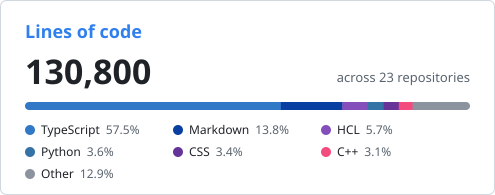

# Hi, I'm Jason Paquette 

**Senior Cloud Engineer** — automating production cloud at scale.

---

## About Me

I'm a Senior Cloud Engineer with 8 years of experience designing, deploying, and operating production AWS infrastructure — with hands-on experience building and maintaining SOC 2–compliant environments.

- **Infrastructure as Code first** — multi-account AWS provisioned with Terraform: VPCs, EC2, least-privilege IAM, Lambda, and security groups under AWS Organizations
- **Operations, not just builds** — five years of after-hours on-call, a hybrid fleet of 600+ Windows and Linux servers under patching, monitoring, and access control, and incident response on production client environments
- **CI/CD everywhere** — multi-environment pipelines in GitLab CI/CD and GitHub Actions, with OIDC federation and ephemeral per-PR preview environments
- **Security-minded** — CIS Foundations Benchmark hardening, Zero Trust Network Access (ZTNA) design and deployment, Prowler evidence scanning, DevSecOps in CI/CD
- **Kubernetes** — GPU-enabled clusters across EKS, AKS, and GKE provisioned with Terraform; NVIDIA GPU Operator and KEDA via Helm; currently studying for the CKA
- **Full lifecycle ownership** — disaster recovery architecture, observability (CloudWatch, Grafana, OpenTelemetry), site-to-site VPN, cost optimization on a $300k+ annual budget
- **Full-stack when it counts** — serverless Next.js/TypeScript apps on AWS with SST, so I can take a system from infrastructure to shipped product

Lowell, MA · AWS Certified Solutions Architect – Associate · HashiCorp Certified: Terraform Associate (004)

---

## Featured Projects

### Open Source Contributions

**[keda-gpu-scaler](https://github.com/pmady/keda-gpu-scaler)** — Contributor (7 merged PRs) · ⭐ 112
KEDA external scaler that autoscales Kubernetes GPU workloads from native NVML metrics.
- Provisioned GPU-enabled Kubernetes clusters across **EKS, AKS, and GKE** with Terraform — custom VPC networking, GPU node pools, and NVIDIA GPU Operator/KEDA via Helm; resolved a GKE-specific NVIDIA container toolkit CNI failure
- Built a pre-built **Grafana dashboard** for GPU fleet visibility (utilization, VRAM, temperature, power draw)
- Added table-driven **Go unit tests** for multi-GPU metric aggregation; authored the architecture docs and diagrams

**[gpu-mcp-server](https://github.com/pmady/gpu-mcp-server)** — Contributor (4 merged PRs) · ⭐ 14
MCP server giving AI agents real-time access to NVIDIA GPU metrics via NVML.
- Hardened the supply chain with **CodeQL scanning and OpenSSF Scorecard** CI workflows
- Automated Docker image publishing on release via GitHub Actions

### Personal Projects

**[TransformMyNotes](https://github.com/jasonp2323/transformmynotes)** · [Live →](https://transformmynotes.com)
Mobile-first web app that digitizes handwritten study notes — image capture, AI transcription via **Amazon Bedrock**, a Notion-style block editor, and a full-text searchable notebook.
- Fully serverless AWS stack with **SST v4** — Next.js App Router, Lambda, S3, DynamoDB, Cognito, CloudFront, Resend
- Invite/approval-gated access with admin panel, groups, shared notes, and a spaced-repetition review deck

**[Token Buzz](https://github.com/Token-Buzz)** · [Live →](https://tokenbuzz.app)
Real-time crypto signal-intelligence platform ingesting social chatter from X, Farcaster, Telegram, and Reddit — trending tokens, watchlists, alerts, and LLM-summarized context via Amazon Bedrock.
- Serverless AWS stack (SST v4) — CloudFront, Lambda, DynamoDB, SQS, EventBridge — behind **Cloudflare DNS/WAF** with Clerk auth
- **DynamoDB single-table design** with purpose-built GSIs; per-user API keys encrypted at rest with AES/KMS envelope encryption
- AWS account hardened to **CIS Foundations Benchmark v6.0** via Terraform; CI/CD through GitHub Actions with short-lived OIDC credentials and per-PR preview environments

**[compliance-cis-6.0](https://github.com/jasonp2323/compliance-cis-6.0)**
Dedicated Terraform project implementing the CIS AWS Foundations Benchmark v6.0 — CloudTrail, IAM Access Analyzer, default security group lockdown based on Prowler evidence scans.

**[jpcloudengineering.com](https://jpcloudengineering.com)**
This portfolio itself is a cloud engineering project — statically exported Next.js on a private S3 bucket behind CloudFront with Origin Access Control, a serverless contact form (API Gateway + ARM64 Lambda + SES), automated daily cost digests via EventBridge/Cost Explorer, and **four reusable Terraform modules** managing the whole stack, deployed by a tag-driven GitLab CI/CD pipeline with OIDC federation.

### Client Sites
[Dorval Construction](https://dorvalconstruction.com) · [Saudade Café](https://saudadecafe.cafe)
Production Next.js sites on S3 + CloudFront with serverless contact forms (API Gateway/Lambda/SES), Cloudflare DNS, and headless CMS (Sanity) where content management is needed.

---

## Tech Stack

  

  

  
  
  
  
  
   
  
  
  
  
  
  
   
  
  
  
  
  

---

## Currently

**Cloud Engineer @ Direct IT** (Waltham, MA) — designing, deploying, and managing AWS infrastructure for multiple clients in parallel: Terraform-provisioned multi-account environments, ZTNA rollout for a SOC 2–compliant client environment, highly available disaster recovery, and cost-tuned architectures.

## Certifications

- **HashiCorp Certified: Terraform Associate (004)** (2026)
- **AWS Certified Solutions Architect – Associate** (2024)

---

## GitHub Stats

  
  

---
